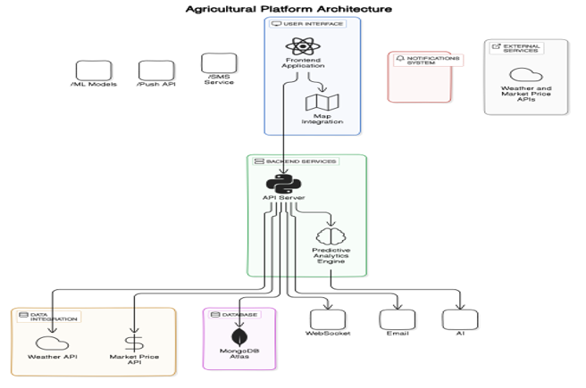
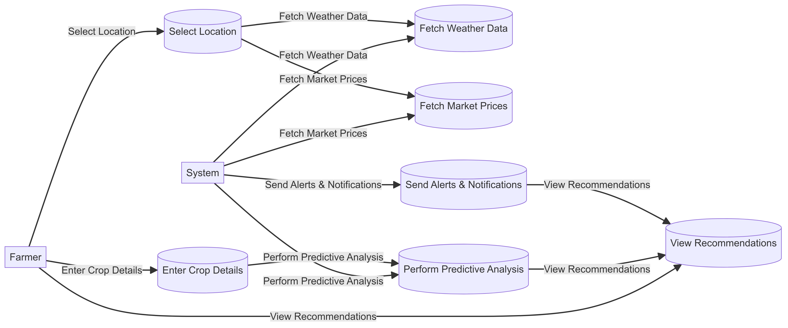
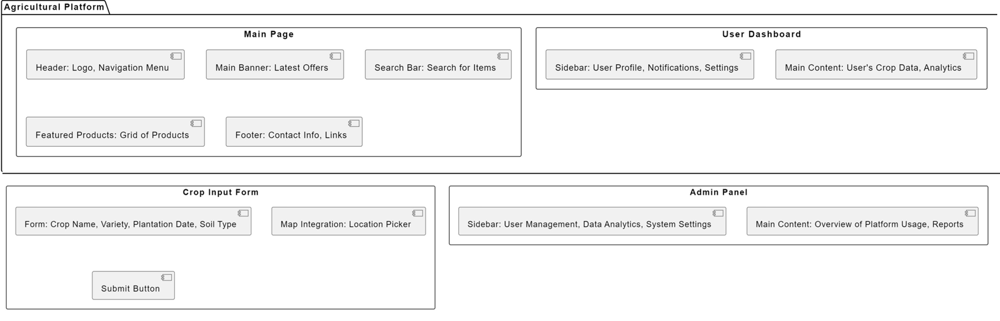

# AgriSURE-Greenathon-2024

:

---

# Agriculture Prediction Platform

## Overview

This platform leverages Ai/ml and various technologies to help farmers manage their crops effectively. It gathers data about crop location, type, planting date, soil, water resources, irrigation systems, land area, and market prices to predict crop value and income. It also forecasts the impact of unexpected weather events and provides prevention techniques.

## Features

- **Crop Information Input**: Users can enter crop location, name, variety, planting date, soil type, water resources, irrigation system, and land area.
- **Market Price Integration**: Current and forecasted market prices are used to predict crop value and income.
- **Weather Impact Analysis**: The platform assesses the impact of unexpected events such as rain, storms, heatwaves, and cyclones on crops.
- **Visualization**: Data is presented using plots (e.g., with PyPlot) to help users understand potential impacts and trends.
- **Alerts and Prevention**: Farmers are notified of upcoming dangers and given advice on how to protect their crops based on current and forecasted weather.

## Technologies Used

- **Flask**: For creating the web application.
- **ChatGPT**: For handling user inputs and generating recommendations.
- **APIs**: For weather forecasts and market prices.
- **PyPlot/Other Plotting Libraries**: For data visualization.

## Setup

### Prerequisites

- Python 3.8+
- Flask
- Requests
- Pandas
- Matplotlib (or other plotting libraries)
- API keys for weather and market data

### Installation

1. **Clone the Repository**

    ```bash
    git clone <repository-url>
    cd <repository-directory>
    ```

2. **Install Dependencies**

    Create a virtual environment and install the necessary packages:

    ```bash
    python -m venv venv
    source venv/bin/activate  # On Windows use `venv\Scripts\activate`
    pip install -r requirements.txt
    ```

3. **Set Up Environment Variables**

    Create a `.env` file in the root directory and add your API keys and other sensitive information:

    ```env
    WEATHER_API_KEY=<your-weather-api-key>
    MARKET_API_KEY=<your-market-api-key>
    ```

4. **Run the Application**

    ```bash
    flask run
    ```

    The application will be available at `http://127.0.0.1:5000`.

## Working Diagrams & Working Prototype Picture of Platform  

### Architecture Diagram  
  

### Flow Diagram  
  

### WireFrame Diagram  
  

### Prototype Screenshots  


## API Integration

### Weather API

- **Base URL**: `https://api.weatherapi.com/v1/`
- **Endpoint**: `forecast.json`
- **Parameters**: `key`, `q` (location), `days` (number of days to forecast)

### Market Data API

- **Base URL**: `https://api.marketdata.com/v1/`
- **Endpoint**: `prices`
- **Parameters**: `apikey`, `commodity`, `location`

## Visualization

Use libraries such as Matplotlib to create plots. Example:

```python
import matplotlib.pyplot as plt

def plot_data(x, y):
    plt.plot(x, y)
    plt.xlabel('Time')
    plt.ylabel('Price')
    plt.title('Market Price Over Time')
    plt.show()
```

## Alerts and Recommendations

Implement logic to analyze weather forecasts and market data to provide actionable insights and alerts. Use ChatGPT to generate recommendations based on this data.

## Contributing

Feel free to fork the repository and submit pull requests. For any issues or feature requests, please open an issue on GitHub.

## License

This project is licensed under the MIT License. See the [LICENSE](LICENSE) file for details.

---

Feel free to adjust and expand this based on your specific needs and the features you implement!
